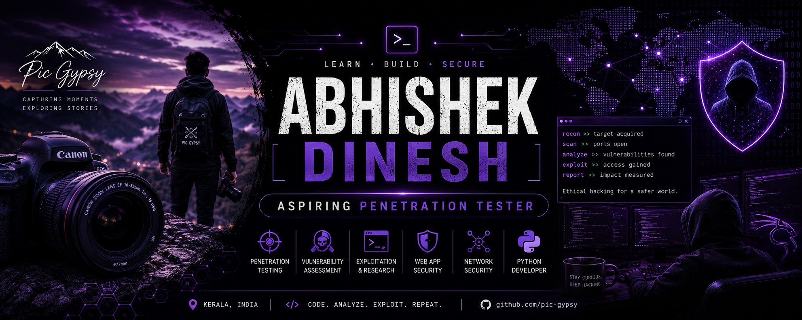

  

  
  
  

# 👋 Hi there, I'm Abhishek Dinesh

### 🛡️ Aspiring Penetration Tester | Cybersecurity Enthusiast | Python Developer

> *Learning by building. Securing by understanding.*

---

## 🚀 About Me

I'm passionate about cybersecurity, with a strong interest in **Blue Team operations, Penetration Testing, Threat Intelligence, Incident Response, and Security Automation**. I enjoy building practical tools in Python while continuously expanding my skills through hands-on labs and personal projects.

- 🔐 Currently preparing for **CompTIA CySA+**
- 🖥️ Building cybersecurity tools using **Python**
- 🌐 Interested in Threat Intelligence, SIEM, and Incident Response
- 📊 Exploring Detection Engineering and Security Automation
- 📚 Always learning through labs and personal projects

---

## 💻 Tech Stack

### Programming
- Python
- SQL (Basic)
- Bash (Basic)

### Cybersecurity
- Threat Intelligence
- Incident Response
- Log Analysis
- Network Security
- Vulnerability Assessment
- MITRE ATT&CK Framework
- OSINT

### Tools

- Kali Linux
- Wireshark
- Nmap
- Burp Suite
- Splunk
- Metasploit
- John the Ripper
- Hydra
- Git
- GitHub
- Visual Studio Code

---

## 📂 Featured Projects

### 🔍 Threat Intelligence Platform

A Python-based threat intelligence tool featuring:

- IOC Analysis
- IP Reputation Lookup
- MITRE ATT&CK Mapping
- Risk Scoring
- Automated Report Generation

---

### 🛡️ File Integrity Monitor
A lightweight Python-based File Integrity Monitoring (FIM) tool that detects unauthorized file modifications using SHA-256 hashing, real-time monitoring, and desktop notifications.

**Tech:** Python • SHA-256 • File System Monitoring

---

### 🌐 IP Threat Hunter
A Python-powered Threat Intelligence tool for IP reputation lookup, IOC enrichment, MITRE ATT&CK mapping, risk scoring, and automated report generation.

**Tech:** Python • Threat Intelligence • MITRE ATT&CK • OSINT

---

### 🔑 Password Strength Checker
A Machine Learning-based password strength analyzer that evaluates passwords using entropy calculation, feature extraction, and Random Forest classification.

**Tech:** Python • Scikit-learn • Machine Learning • Cybersecurity

---

## 🔨 Upcoming Projects

- 📋 SOC Log Analyzer
- 🕵️ IOC Enrichment Tool
- 🌐 Network Scanner
- 📦 PCAP Analyzer
- 🛡️ YARA Rule Scanner
- 🔍 Web Vulnerability Scanner

---

## 📚 Currently Learning

- CompTIA CySA+
- SOC Operations
- Threat Hunting
- Detection Engineering
- Security Automation

---

## 🎯 Goals

- ✅ Earn CompTIA CySA+
- 🚀 Build practical cybersecurity projects
- 🌐 Contribute to open-source security tools
- 📊 Learn Microsoft Sentinel
- 🛡️ Learn Wazuh
- ☁️ Explore Cloud Security

---

## 📫 Connect With Me

- GitHub: https://github.com/pic-gypsy

---

## 💡 Motto

> **"Every vulnerability understood is another system better protected."**

---

⭐ Thanks for visiting my profile! Feel free to explore my repositories and follow my cybersecurity journey.
